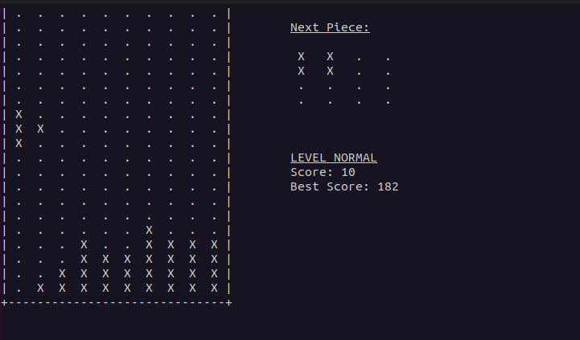

# Tetris Game in Python (Console Version)

## Overview

This is a console-based Tetris game implemented in Python. The game runs in the terminal and features standard Tetris gameplay mechanics including moving pieces, rotating, and clearing lines. The game consists of three levels with varying piece fall speeds: normal, fast, and fast and furious.

## Features

- **4x4 Block Pieces:** Each Tetris piece is represented as a 4x4 block.
- **Game Grid:** The game board is 10 columns wide and 20 lines high.
- **Movement Controls:** Move pieces left, right, accelerate to the bottom, and rotate using direction keys.
- **Collision Management:** Pieces stop moving when they hit the bottom or other pieces.
- **Line Clearing:** Complete lines are cleared, and the score increases.
- **Levels:** Three levels with different fall speeds: normal, fast, and fast and furious.
- **Game Over:** The game ends when there is no space for a new piece.

## Installation

1. **Ensure Python is installed:** This game is built using Python. Download and install it from the [official Python website](https://www.python.org/downloads/).

2. **Clone the Repository:**

   ```bash
   git clone https://github.com/njnerson/tetris-console.git
   cd tetris-console
   ```

3. **Install Dependencies:**

   Install **pygame**

   ```bash
   pip install pygame
   ```

   **On Windows Only:**

   On Windows, need to install **windows-curses**

   ```bash
   pip install windows-curses
   ```

## Usage

1. **Run the Game:**

   ```bash
   python main.py
   ```

2. **Game Controls:**
   - **Arrow Keys:** Move the piece left, right, or accelerate down.
   - **Up Arrow:** Rotate the piece 90° clockwise.
   - **Space Bar:** Pause and resume the game.

## Code Structure

- **`main.py`:** Main file to run the game.
- **`utils/board.py`:** Contains the `Board` class which manages the game grid, piece movements, collisions, and scoring.
- **`utils/pieces.py`:** Contains the `Piece` class to represent Tetris pieces and their rotations.
- **`utils/game_suspend.py`:** Manages the game pausing functionality.
- **`utils/game_end.py`:** Contains functions to handle end of a party.
- **`utils/piece_move.py`:** Contains functions about pieces behavior.
- **`utils/level.py`:** Contains functions to manage level of game.
- **`utils/piece_queue.py`:** Contains class to manage piece queue.
- **`utils/score.py`:** Contains class to manage best score for each level of game.
- **`docs/`:** Contains media files( musics and pictures)

## Example Gameplay

To start the game, run the following command:

```bash
python main.py
```

## Screenshot



##

Use the arrow keys to control the pieces. The game will display the current score and level. The game ends when there is no space for a new piece to appear.

## Contributing

Feel free to fork the repository and submit pull requests. Contributions are welcome!
